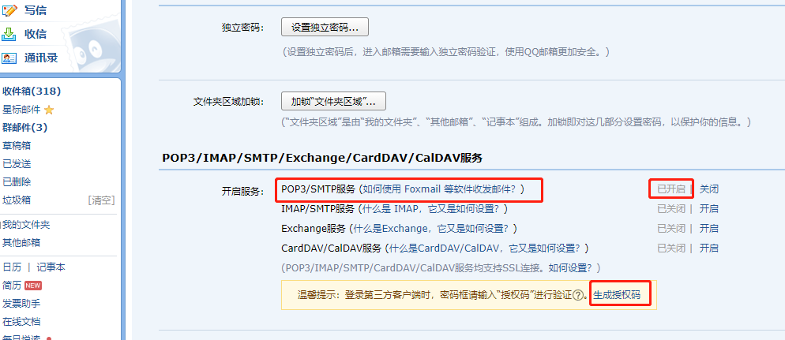

# nest接入nodemailer并通过QQ邮箱发送邮件步骤

## 设置smtp服务
首先， 你需要去你的QQ邮箱， 设置 -》账户里 开启SMTP服务，才能进行收发操作。
你需要生成并留下你的授权码，下面发送时需要用到


## 安装nodemailer

```node
pnpm add --save nodemailer
```

## 创建传播方式

这里我采用的是QQ的形式
```js
const transporter = nodemailer.createTransport({
  service: 'QQ', // 使用了内置传输发送邮件 查看支持列表：https://nodemailer.com/smtp/well-known/
  port: 465, // SMTP 端口
  secureConnection: false, // 使用了 SSL
  auth: {
    user: this.configService.get('EMAIL_USER', ''), // 这里传入你注册授权码的用户名 比如 xxxx@qq.com
    pass: this.configService.get('EMAIL_PASS', ''), // 这里需要传入你对应的授权码
  },
});
```

## 注册发送邮件给用户

```js
// 前置配置
const options = {
  // 发件人 邮箱  '昵称<发件人邮箱>'
  from: `"xxx在不在"<xxxxx@qq.com>`,  // 这里是你开启SMTP服务的QQ邮箱号 
  to: email,  // 这个是前端页面注册时输入的邮箱号
  subject: '感谢xxxx注册全国最大的南桐俱乐部！',
  html: `<span>xxxx欢迎您的加入！</span>
          <a href="http://localhost:8080/">点击按钮，成为南桐！</a>`
}

// 发送邮件
transporter.sendMail(options, function (err, msg) {
  if (err) {
    res.send(err)
  } else {
    res.send('邮箱发送成功!')
  }
})

```
